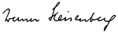

<table class="infobox biography vcard">
<tbody>
<tr>
<th colspan="2">

Werner Heisenberg

</th>
</tr>
<tr>
<td colspan="2">

Heisenberg in 1933

</td>
</tr>
<tr>
<th scope="row">Born</th>
<td>

Werner Karl Heisenberg

 5 December 1901 

<a title="W&uuml;rzburg" href="https://en.wikipedia.org/wiki/W%C3%BCrzburg">W&uuml;rzburg</a>,&nbsp;<a title="Kingdom of Bavaria" href="https://en.wikipedia.org/wiki/Kingdom_of_Bavaria">Bavaria</a>,&nbsp;<a title="German Empire" href="https://en.wikipedia.org/wiki/German_Empire">German Empire</a>

</td>
</tr>
<tr>
<th scope="row">Died</th>
<td>1 February 1976&nbsp;(aged&nbsp;74) 

<a title="Munich" href="https://en.wikipedia.org/wiki/Munich">Munich</a>, Bavaria,&nbsp;<a title="West Germany" href="https://en.wikipedia.org/wiki/West_Germany">West Germany</a>

</td>
</tr>
<tr>
<th scope="row">Resting place</th>
<td class="label"><a title="Munich Waldfriedhof" href="https://en.wikipedia.org/wiki/Munich_Waldfriedhof">Munich Waldfriedhof</a></td>
</tr>
<tr>
<th scope="row">Alma&nbsp;mater</th>
<td>

<ul>
<li><a class="mw-redirect" title="University of Munich" href="https://en.wikipedia.org/wiki/University_of_Munich">University of Munich</a></li>
<li><a title="University of G&ouml;ttingen" href="https://en.wikipedia.org/wiki/University_of_G%C3%B6ttingen">University of G&ouml;ttingen</a></li>
</ul>

</td>
</tr>
<tr>
<th scope="row">Known&nbsp;for</th>
<td>

&nbsp;

<ul class="mw-collapsible-content">
<li><a title="Uncertainty principle" href="https://en.wikipedia.org/wiki/Uncertainty_principle">Uncertainty principle</a></li>
<li><a title="Copenhagen interpretation" href="https://en.wikipedia.org/wiki/Copenhagen_interpretation">Copenhagen interpretation</a></li>
<li><a title="Heisenberg cut" href="https://en.wikipedia.org/wiki/Heisenberg_cut">Heisenberg cut</a></li>
<li><a title="Heisenberg's entryway to matrix mechanics" href="https://en.wikipedia.org/wiki/Heisenberg%27s_entryway_to_matrix_mechanics">Heisenberg's entryway to matrix mechanics</a></li>
<li><a class="mw-redirect" title="Heisenberg ferromagnet" href="https://en.wikipedia.org/wiki/Heisenberg_ferromagnet">Heisenberg ferromagnet</a></li>
<li><a title="Heisenberg group" href="https://en.wikipedia.org/wiki/Heisenberg_group">Heisenberg group</a></li>
<li><a class="mw-redirect" title="Heisenberg limit" href="https://en.wikipedia.org/wiki/Heisenberg_limit">Heisenberg limit</a></li>
<li><a title="Heisenberg's microscope" href="https://en.wikipedia.org/wiki/Heisenberg%27s_microscope">Heisenberg's microscope</a></li>
<li><a class="mw-redirect" title="Heisenberg model (classical)" href="https://en.wikipedia.org/wiki/Heisenberg_model_(classical)">Heisenberg model (classical)</a></li>
<li><a title="Heisenberg model (quantum)" href="https://en.wikipedia.org/wiki/Heisenberg_model_(quantum)">Heisenberg model (quantum)</a></li>
<li><a title="Heisenberg picture" href="https://en.wikipedia.org/wiki/Heisenberg_picture">Heisenberg picture</a></li>
<li><a title="Heisenberg&ndash;Langevin equations" href="https://en.wikipedia.org/wiki/Heisenberg%E2%80%93Langevin_equations">Heisenberg&ndash;Langevin equations</a></li>
<li><a class="mw-redirect" title="Euler-Heisenberg Lagrangian" href="https://en.wikipedia.org/wiki/Euler-Heisenberg_Lagrangian">Euler-Heisenberg Lagrangian</a></li>
<li><a class="mw-redirect" title="Kramers-Heisenberg formula" href="https://en.wikipedia.org/wiki/Kramers-Heisenberg_formula">Kramers-Heisenberg formula</a></li>
<li><a title="Isospin" href="https://en.wikipedia.org/wiki/Isospin">Isospin</a></li>
<li><a title="Matrix mechanics" href="https://en.wikipedia.org/wiki/Matrix_mechanics">Matrix mechanics</a></li>
<li><a title="Bootstrap model" href="https://en.wikipedia.org/wiki/Bootstrap_model">Bootstrap model</a></li>
<li><a title="C*-algebra" href="https://en.wikipedia.org/wiki/C*-algebra">C*-algebra</a></li>
<li><a title="Exchange force" href="https://en.wikipedia.org/wiki/Exchange_force">Exchange force</a></li>
<li><a title="Exchange interaction" href="https://en.wikipedia.org/wiki/Exchange_interaction">Exchange interaction</a></li>
<li><a title="Electron hole" href="https://en.wikipedia.org/wiki/Electron_hole">Electron hole theory</a></li>
<li><a title="Mott problem" href="https://en.wikipedia.org/wiki/Mott_problem">Mott problem</a></li>
<li><a title="Quantum fluctuation" href="https://en.wikipedia.org/wiki/Quantum_fluctuation">Quantum fluctuation</a></li>
<li><a title="Quantum spacetime" href="https://en.wikipedia.org/wiki/Quantum_spacetime">Quantum spacetime</a></li>
<li><a title="Resonance (chemistry)" href="https://en.wikipedia.org/wiki/Resonance_(chemistry)">Resonance (chemistry)</a></li>
<li><a title="S-matrix" href="https://en.wikipedia.org/wiki/S-matrix">S-matrix</a></li>
<li><a title="S-matrix theory" href="https://en.wikipedia.org/wiki/S-matrix_theory">S-matrix theory</a></li>
<li><a title="Discovery of the neutron" href="https://en.wikipedia.org/wiki/Discovery_of_the_neutron#Proton%E2%80%93neutron_model_of_the_nucleus">Proton&ndash;neutron model of the nucleus</a></li>
<li><a title="Vacuum polarization" href="https://en.wikipedia.org/wiki/Vacuum_polarization">Vacuum polarization</a></li>
<li><a title="Wave function collapse" href="https://en.wikipedia.org/wiki/Wave_function_collapse">Wave function collapse</a></li>
<li><a class="mw-redirect" title="German nuclear weapon project" href="https://en.wikipedia.org/wiki/German_nuclear_weapon_project"><em>Uranprojekt</em></a></li>
</ul>

</td>
</tr>
<tr>
<th scope="row">Spouse(s)</th>
<td>

Elisabeth Schumacher

(<abbr title="married">m.</abbr>&nbsp;after&nbsp;1937)<wbr />

</td>
</tr>
<tr>
<th scope="row">Children</th>
<td>7 (incl.&nbsp;<a title="Jochen Heisenberg" href="https://en.wikipedia.org/wiki/Jochen_Heisenberg">Jochen</a>&nbsp;and&nbsp;<a title="Martin Heisenberg" href="https://en.wikipedia.org/wiki/Martin_Heisenberg">Martin</a>)</td>
</tr>
<tr>
<th scope="row">Awards</th>
<td>

<ul>
<li><a title="Matteucci Medal" href="https://en.wikipedia.org/wiki/Matteucci_Medal">Matteucci Medal</a>&nbsp;(1929)</li>
<li><a title="Barnard Medal for Meritorious Service to Science" href="https://en.wikipedia.org/wiki/Barnard_Medal_for_Meritorious_Service_to_Science">Barnard Medal for Meritorious Service to Science</a>&nbsp;(1930)</li>
<li><a title="Nobel Prize in Physics" href="https://en.wikipedia.org/wiki/Nobel_Prize_in_Physics">Nobel Prize in Physics</a>&nbsp;(1932)</li>
<li><a title="Max Planck Medal" href="https://en.wikipedia.org/wiki/Max_Planck_Medal">Max Planck Medal</a>&nbsp;(1933)</li>
<li><a class="mw-redirect" title="Foreign Member of the Royal Society" href="https://en.wikipedia.org/wiki/Foreign_Member_of_the_Royal_Society">Foreign Member of the Royal Society</a>&nbsp;(1955)</li>
<li><a class="mw-redirect" title="Foreign Associate of the National Academy of Sciences" href="https://en.wikipedia.org/wiki/Foreign_Associate_of_the_National_Academy_of_Sciences">Foreign Associate of the National Academy of Sciences</a>&nbsp;(1961)</li>
</ul>

</td>
</tr>
<tr>
<td colspan="2"><strong>Scientific career</strong></td>
</tr>
<tr>
<th scope="row">Fields</th>
<td class="category"><a title="Theoretical physics" href="https://en.wikipedia.org/wiki/Theoretical_physics">Theoretical physics</a></td>
</tr>
<tr>
<th scope="row">Institutions</th>
<td>

<ul>
<li><a title="University of G&ouml;ttingen" href="https://en.wikipedia.org/wiki/University_of_G%C3%B6ttingen">University of G&ouml;ttingen</a></li>
<li><a title="University of Copenhagen" href="https://en.wikipedia.org/wiki/University_of_Copenhagen">University of Copenhagen</a></li>
<li><a class="mw-redirect" title="University of Leipzig" href="https://en.wikipedia.org/wiki/University_of_Leipzig">University of Leipzig</a></li>
<li><a class="mw-redirect" title="University of Berlin" href="https://en.wikipedia.org/wiki/University_of_Berlin">University of Berlin</a></li>
<li><a class="mw-redirect" title="University of Munich" href="https://en.wikipedia.org/wiki/University_of_Munich">University of Munich</a></li>
</ul>

</td>
</tr>
<tr>
<th scope="row"><a title="Thesis" href="https://en.wikipedia.org/wiki/Thesis">Thesis</a></th>
<td><a class="external text" href="https://www.worldcat.org/title/uber-stabilitat-und-turbulenz-von-flussigkeitsstromen/oclc/634404649" rel="nofollow"><em>&Uuml;ber Stabilit&auml;t und Turbulenz von Fl&uuml;ssigkeitsstr&ouml;men (On stability and turbulence of liquid flows)</em></a>&nbsp;(1923)</td>
</tr>
<tr>
<th scope="row"><a title="Doctoral advisor" href="https://en.wikipedia.org/wiki/Doctoral_advisor">Doctoral advisor</a></th>
<td><a title="Arnold Sommerfeld" href="https://en.wikipedia.org/wiki/Arnold_Sommerfeld">Arnold Sommerfeld</a></td>
</tr>
<tr>
<th scope="row">Other&nbsp;academic advisors</th>
<td>

<ul>
<li><a title="Niels Bohr" href="https://en.wikipedia.org/wiki/Niels_Bohr">Niels Bohr</a></li>
<li><a title="Max Born" href="https://en.wikipedia.org/wiki/Max_Born">Max Born</a></li>
</ul>

</td>
</tr>
<tr>
<th scope="row">Doctoral students</th>
<td>

<ul>
<li><a title="Felix Bloch" href="https://en.wikipedia.org/wiki/Felix_Bloch">Felix Bloch</a></li>
<li><a title="Edward Teller" href="https://en.wikipedia.org/wiki/Edward_Teller">Edward Teller</a></li>
<li><a class="mw-redirect" title="Rudolf E. Peierls" href="https://en.wikipedia.org/wiki/Rudolf_E._Peierls">Rudolf E. Peierls</a></li>
<li><a title="Reinhard Oehme" href="https://en.wikipedia.org/wiki/Reinhard_Oehme">Reinhard Oehme</a></li>
<li><a title="Friedwardt Winterberg" href="https://en.wikipedia.org/wiki/Friedwardt_Winterberg">Friedwardt Winterberg</a></li>
<li>Peter Mittelstaedt</li>
<li><a title="Șerban Țițeica" href="https://en.wikipedia.org/wiki/%C8%98erban_%C8%9Ai%C8%9Beica">Șerban Țițeica</a></li>
<li><a title="Ivan Supek" href="https://en.wikipedia.org/wiki/Ivan_Supek">Ivan Supek</a></li>
<li><a title="Erich Bagge" href="https://en.wikipedia.org/wiki/Erich_Bagge">Erich Bagge</a></li>
<li><a title="Hermann Arthur Jahn" href="https://en.wikipedia.org/wiki/Hermann_Arthur_Jahn">Hermann Arthur Jahn</a></li>
<li>Heimo Dolch</li>
<li><a title="Hans Heinrich Euler" href="https://en.wikipedia.org/wiki/Hans_Heinrich_Euler">Hans Heinrich Euler</a></li>
<li>Edwin Gora</li>
<li>Bernhard Kockel</li>
<li>Arnold Siegert</li>
<li>Wang Foh-san</li>
<li>Karl Ott</li>
<li>Bary F. Malik</li>
</ul>

</td>
</tr>
<tr>
<th scope="row">Other&nbsp;notable students</th>
<td>

<ul>
<li><a class="mw-redirect" title="William Vermillion Houston" href="https://en.wikipedia.org/wiki/William_Vermillion_Houston">William Vermillion Houston</a></li>
<li><a title="Guido Beck" href="https://en.wikipedia.org/wiki/Guido_Beck">Guido Beck</a></li>
<li><a title="Ugo Fano" href="https://en.wikipedia.org/wiki/Ugo_Fano">Ugo Fano</a></li>
<li><a title="Ettore Majorana" href="https://en.wikipedia.org/wiki/Ettore_Majorana">Ettore Majorana</a></li>
<li><a title="Herbert Wagner (physicist)" href="https://en.wikipedia.org/wiki/Herbert_Wagner_(physicist)">Herbert Wagner</a></li>
</ul>

</td>
</tr>
<tr>
<th scope="row">Influenced</th>
<td>

<ul>
<li><a title="Robert D&ouml;pel" href="https://en.wikipedia.org/wiki/Robert_D%C3%B6pel">Robert D&ouml;pel</a></li>
<li><a title="Carl Friedrich von Weizs&auml;cker" href="https://en.wikipedia.org/wiki/Carl_Friedrich_von_Weizs%C3%A4cker">Carl Friedrich von Weizs&auml;cker</a></li>
</ul>

</td>
</tr>
<tr>
<th colspan="2">Signature</th>
</tr>
<tr>
<td colspan="2"></td>
</tr>
</tbody>
</table>
 

<strong>Werner Karl Heisenberg</strong>&nbsp;(5 December 1901 &ndash; 1 February 1976)&nbsp;was a German&nbsp;<a class="mw-redirect" title="Theoretical physicist" href="https://en.wikipedia.org/wiki/Theoretical_physicist">theoretical physicist</a>&nbsp;and one of the key pioneers of&nbsp;<a title="Quantum mechanics" href="https://en.wikipedia.org/wiki/Quantum_mechanics">quantum mechanics</a>. He published his work in 1925 in a&nbsp;<a title="&Uuml;ber quantentheoretische Umdeutung kinematischer und mechanischer Beziehungen" href="https://en.wikipedia.org/wiki/%C3%9Cber_quantentheoretische_Umdeutung_kinematischer_und_mechanischer_Beziehungen">breakthrough paper</a>. In the subsequent series of papers with&nbsp;<a title="Max Born" href="https://en.wikipedia.org/wiki/Max_Born">Max Born</a>&nbsp;and&nbsp;<a title="Pascual Jordan" href="https://en.wikipedia.org/wiki/Pascual_Jordan">Pascual Jordan</a>, during the same year, this&nbsp;<a title="Matrix mechanics" href="https://en.wikipedia.org/wiki/Matrix_mechanics">matrix formulation</a>&nbsp;of quantum mechanics was substantially elaborated. He is known for the&nbsp;<a title="Uncertainty principle" href="https://en.wikipedia.org/wiki/Uncertainty_principle">uncertainty principle</a>, which he published in 1927. Heisenberg was awarded the 1932&nbsp;<a title="Nobel Prize in Physics" href="https://en.wikipedia.org/wiki/Nobel_Prize_in_Physics">Nobel Prize in Physics</a>&nbsp;"for the creation of quantum mechanics".<a href="https://en.wikipedia.org/wiki/Werner_Heisenberg#cite_note-old-5">[a]</a>

Heisenberg also made important contributions to the theories of the&nbsp;<a title="Fluid dynamics" href="https://en.wikipedia.org/wiki/Fluid_dynamics">hydrodynamics</a>&nbsp;of&nbsp;<a class="mw-redirect" title="Turbulent flow" href="https://en.wikipedia.org/wiki/Turbulent_flow">turbulent flows</a>, the&nbsp;<a title="Atomic nucleus" href="https://en.wikipedia.org/wiki/Atomic_nucleus">atomic nucleus</a>,&nbsp;<a title="Ferromagnetism" href="https://en.wikipedia.org/wiki/Ferromagnetism">ferromagnetism</a>,&nbsp;<a class="mw-redirect" title="Cosmic rays" href="https://en.wikipedia.org/wiki/Cosmic_rays">cosmic rays</a>, and&nbsp;<a class="mw-redirect" title="Subatomic particles" href="https://en.wikipedia.org/wiki/Subatomic_particles">subatomic particles</a>. He was a principal scientist in the&nbsp;<a title="German nuclear weapons program" href="https://en.wikipedia.org/wiki/German_nuclear_weapons_program">German nuclear weapons program</a>&nbsp;during&nbsp;<a title="World War II" href="https://en.wikipedia.org/wiki/World_War_II">World War II</a>. He was also instrumental in planning the first West German&nbsp;<a title="Nuclear reactor" href="https://en.wikipedia.org/wiki/Nuclear_reactor">nuclear reactor</a>&nbsp;at&nbsp;<a title="Karlsruhe" href="https://en.wikipedia.org/wiki/Karlsruhe">Karlsruhe</a>, together with a&nbsp;<a title="Research reactor" href="https://en.wikipedia.org/wiki/Research_reactor">research reactor</a>&nbsp;in&nbsp;<a title="Munich" href="https://en.wikipedia.org/wiki/Munich">Munich</a>, in 1957.

Following World War II, he was appointed director of the&nbsp;<a class="mw-redirect" title="Kaiser Wilhelm Institute for Physics" href="https://en.wikipedia.org/wiki/Kaiser_Wilhelm_Institute_for_Physics">Kaiser Wilhelm Institute for Physics</a>, which soon thereafter was renamed the&nbsp;<a title="Max Planck Institute for Physics" href="https://en.wikipedia.org/wiki/Max_Planck_Institute_for_Physics">Max Planck Institute for Physics</a>. He was director of the institute until it was moved to Munich in 1958. He then became director of the&nbsp;<a title="Max Planck Institute for Physics and Astrophysics" href="https://en.wikipedia.org/wiki/Max_Planck_Institute_for_Physics_and_Astrophysics">Max Planck Institute for Physics and Astrophysics</a>&nbsp;from 1960 to 1970.

Heisenberg was also president of the&nbsp;<a class="mw-redirect" title="Deutsche Forschungsgemeinschaft" href="https://en.wikipedia.org/wiki/Deutsche_Forschungsgemeinschaft">German Research Council</a>,&nbsp;chairman of the Commission for Atomic Physics, chairman of the Nuclear Physics Working Group, and president of the&nbsp;<a title="Alexander von Humboldt Foundation" href="https://en.wikipedia.org/wiki/Alexander_von_Humboldt_Foundation">Alexander von Humboldt Foundation</a>.

 

<strong> Publications: </strong>

<ul>

 <li><a target="_blank" href="https://github.com/manjunath5496/Werner-Heisenberg-Papers/blob/master/tst(102).pdf" style="text-decoration:none;">Physics and Beyond: Encounters and Conversations</a></li>
                            
 <li><a target="_blank" href="https://github.com/manjunath5496/Werner-Heisenberg-Papers/blob/master/tst(103).pdf" style="text-decoration:none;"> Physics and Philosophy: The Revolution in Modern Science</a></li>

<li><a target="_blank" href="https://github.com/manjunath5496/Werner-Heisenberg-Papers/blob/master/tst(104).pdf" style="text-decoration:none;">Science and Synthesis: An International Colloquium organized by Unesco on the Tenth Anniversary of the Death of Albert Einstein and Teilhard de Chardin</a></li>
 <li><a target="_blank" href="https://github.com/manjunath5496/Werner-Heisenberg-Papers/blob/master/tst(105).pdf" style="text-decoration:none;">The Physical Principles of the Quantum Theory </a></li>                              
<li><a target="_blank" href="https://github.com/manjunath5496/Werner-Heisenberg-Papers/blob/master/tst(106).pdf" style="text-decoration:none;">On Modern Physics</a></li>
 <li><a target="_blank" href="https://github.com/manjunath5496/Werner-Heisenberg-Papers/blob/master/tst(107).pdf" style="text-decoration:none;">Philosophic Problems of Nuclear Science</a></li> 

 <li><a target="_blank" href="https://github.com/manjunath5496/Werner-Heisenberg-Papers/blob/master/tst(220).pdf" style="text-decoration:none;">The development of quantum mechanics [Nobel Lecture]</a></li> 

</ul>
